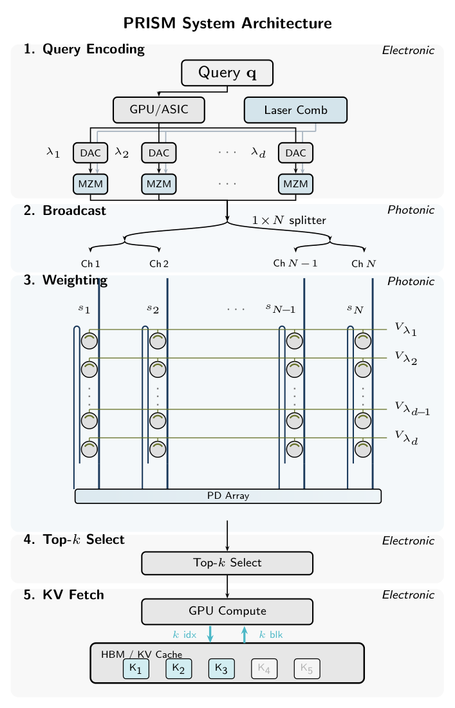
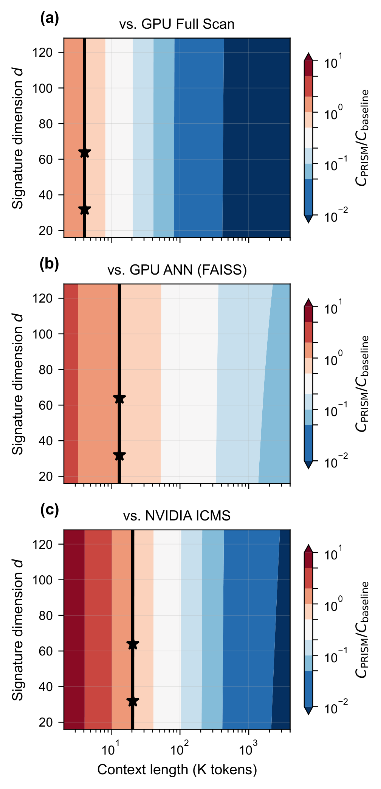
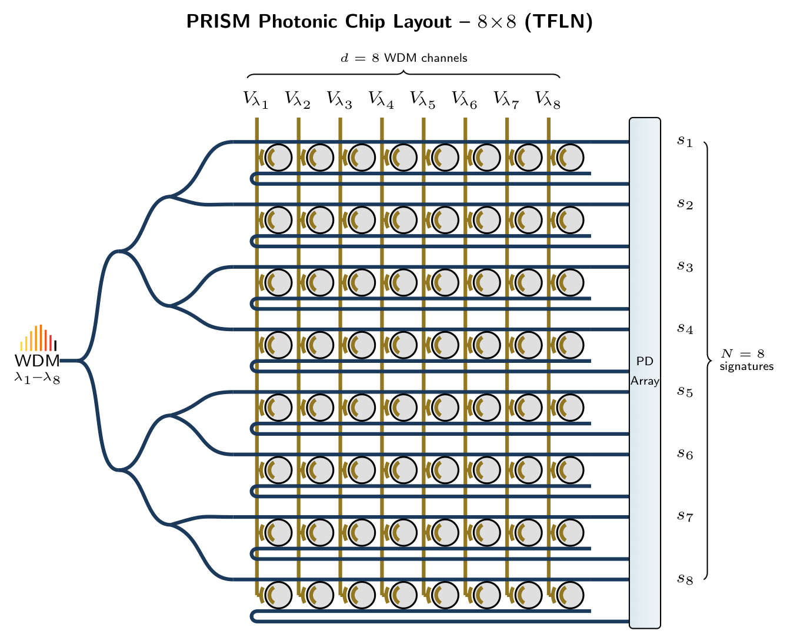

<h1 align="center">PRISM</h1>

<p align="center">
  <b>Photonic block selection for KV cache: O(N) scan to O(1)</b>
</p>

<p align="center">
  
  <a href="LICENSE"></a>
  
  
</p>

<p align="center">
  
</p>

---

## Overview

Long-context LLM decode is memory-bound. Block-selection methods (Quest, RocketKV, InfLLM) reduce the KV blocks fetched per step, but the selection itself still reads all N block signatures from HBM at O(N) cost.

PRISM offloads the selection to a photonic co-processor. The query is encoded onto WDM wavelengths, passively split to N MRR weight-bank channels, and all N similarity scores are computed in a single optical pass. Only the top-k block indices are returned to the GPU. The scan is eliminated; HBM traffic drops from O(N) to O(k).

No chip has been fabricated. All photonic numbers below are device-physics simulations on TFLN. GPU scan timings are measured on H100.

| | GPU Full Scan | GPU Block Selection | ASIC | PRISM |
|---|:---:|:---:|:---:|:---:|
| Scan eliminated? | N/A (reads all) | No | Partially | Yes (broadcast) |
| Signature storage | None | GPU HBM | Local SRAM | MRR weight bank |
| HBM read (selection) | 0 | N×d×2 bytes | 0 (local SRAM) | 0 (stored in MRR) |
| Selection latency | 0 | ~1-5 us | ~10-100 ns | ~9 ns (simulated) |
| Selection energy | 0 | ~4-16 uJ | ~10-100 nJ | ~2.3 nJ (simulated) |
| Scaling with N | O(N) | O(N) | O(N) area | O(1) passive split |
| Static power | 0 | 0 | ~W (SRAM) | ~0 (Pockels EO) |

## Quick Start

```bash
git clone https://github.com/hyoseokp/PRISM.git
cd PRISM
pip install -e .
python demo.py
```

Output (1M context, single query):
```
PRISM vs H100 Comparison Report (N=8192, d=32, k=32)
  Signature scan:   8.5 us (GPU, measured) → ELIMINATED (PRISM)
  Selection:        8.5 us (measured) → 9 ns (simulated)  (944x)
  Energy:           42 uJ (estimated) → 2.3 nJ (simulated) (18,000x)
  HBM traffic:      512 KB scan + 2 MB fetch → 2 MB only
```

## Results

Tested on Qwen2.5-7B, block size B=128, signature dimension d=32.

| Metric | Value | Conditions |
|--------|-------|------------|
| Needle-block hit-rate | 100% | 4K-64K tokens, k=32 |
| KV traffic reduction | 32x | 128K context, k=32, B=128 |
| Retrieval heads | >90% | Qwen2.5-7B, tau=0.3 |
| Proxy recall@32 | 100% | 8K context, mean-key, d=32 |
| Signed weight improvement | +87% | vs ReLU encoding |
| Dynamic selection energy | 2,290 pJ | per query, simulated, optical core only |
| LongBench-v2 (3 domains) | 0% drop | vs full attention, 4K |

GPU scan timings measured on H100. PRISM energy/latency from device-physics simulation (no fabricated chip). Dynamic energy excludes TEC (~1W), amortized by query rate. Details in paper.

## How It Works

```
Every B=128 tokens:   GPU computes block signature → programs MRR weights
Every decode step:    Query → light → broadcast → N inner products → top-k → fetch k blocks
                      \___ O(1) photonic ___/   \__ O(k) electronic __/
```

<p align="center">
  
</p>

MRR transmission implements multiplication; broadband photodetection implements summation. No electronic MAC needed.

## GPU-Only Block Selection

The block selection algorithm runs on GPU without photonic hardware. Similar to Quest/RocketKV but with mean-key signatures and random projection. The GPU-only selector still performs an O(N) signature scan from HBM; the O(1) claim applies only to the photonic co-processor.

```python
from prism.block_selector import BlockSelector

selector = BlockSelector(block_size=128, k=32, d_sig=32, window=256)
selector.build_signatures(kv_keys)           # [n_tokens, d_head]
output = selector.block_sparse_attention(query, kv_keys, kv_values)
```

On GPU, this saves memory by reading only k blocks (same benefit as Quest/RocketKV). The selection scan itself remains O(N). A photonic chip replaces this O(N) scan with O(1) optical evaluation.

### GPU scan cost (measured)

```bash
python benchmarks/compare_selection_methods.py
```

| Context | N blocks | GPU scan (measured) | Photonic (simulated) | Speedup |
|--------:|--------:|-------------------:|----------:|--------:|
| 128K | 1,024 | 1.1 us | 9 ns | 122x |
| 1M | 8,192 | 8.5 us | 9 ns | 944x |
| 10M | 81,920 | 80 us | 9 ns | 8,889x |

Photonic 9 ns is a device-physics estimate, not a measurement.

## Simulator

```python
from prism.simulator import PRISMSimulator

sim = PRISMSimulator(d_sig=32, k=32, block_size=128, bits=5, drift=0.01)
sim.register_signatures(kv_keys)      # [n_tokens, d_head]
top_indices = sim.select(query_vec)    # → k block indices
sim.report()
```

```bash
python benchmarks/profile_kv_scan.py --n_blocks 1024 --d 32
python benchmarks/run_niah.py --quick    # ~2 min, 16GB VRAM
python benchmarks/run_niah.py            # full 4K-64K evaluation
```

## Photonic Hardware Parameters

The workload has properties that map to broadcast-and-weight photonic architectures:

| Workload property | Photonic mapping |
|---|---|
| Query fans out to all N candidates | Passive 1×N optical splitting |
| Block signatures update every 128 tokens | MRR weight programming via EO DC bias |
| Only rank order matters | 4-6 bit precision sufficient |
| Per-token latency-critical | O(1) optical transit vs O(N) electronic scan |

Device parameters used in simulation (X-cut TFLN):

| Parameter | Value |
|-----------|:---:|
| MRR Q | 10,000 |
| Weight precision | 5 bit |
| Tuning | Pockels EO (28.5 pm/V) |
| Static power | ~0 (capacitive) |
| Signed weights | Balanced PD (w in [-1,+1]) |
| WDM channels | d=32-128 |

Hardware models: `prism/hw_sim/mrr_model.py`, `prism/simulator.py`, `scripts/wdm_crosstalk.py`.

## Batch Serving

In batch serving, model weights are amortized across users but each user's signature scan consumes HBM bandwidth. PRISM removes this per-user HBM cost entirely.

### Decode step breakdown (batch=128, 1M context, Qwen2.5-7B on H100)

| Stage | GPU Full Scan | GPU Block Sel. | PRISM (1 chip) |
|-------|:---:|:---:|:---:|
| Model weights | 4,179 us | 4,179 us | 4,179 us |
| KV full read | 2,189,254 us | - | - |
| Signature scan | - | 8,567 us | - |
| Photonic selection | - | - | 1,490 us |
| KV fetch (k=32) | - | 8,567 us | 8,567 us |
| **Total** | **2,193 ms** | **21.3 ms** | **14.3 ms** |

GPU Full Scan at batch=128 is infeasible on a single H100 (7,348 GB total HBM reads). Included as a theoretical baseline.

### Scaling with context length

GPU block selection scan grows as O(N). PRISM (N_chip=1,024) pages through blocks when N > N_chip, growing as O(N/N_chip) with a per-page cost of 13 ns.

| Batch=128 | GPU Block Sel. (ms) | PRISM (ms) | Speedup |
|-----------|:---:|:---:|:---:|
| 128K | 13.8 | 13.0 | 1.06x |
| 1M | 21.3 | 14.3 | 1.5x |
| 10M | 98.3 | 27.7 | 3.5x |
| 100M | 859 | 161.8 | 5.3x |

PRISM uses time-division multiplexing: one chip (N_chip=1,024) serves 128 users by reprogramming MRR weights per user (~4 ns, TFLN Pockels EO) + photonic evaluation (~9 ns) = 13 ns/user/head. When context exceeds chip capacity, PRISM pages through ceil(N/N_chip) configurations. Adding parallel banks eliminates paging. GPU timings from H100 datasheet. PRISM timings from device-physics simulation.

## Energy Crossover

<p align="center">
  
</p>

<p align="center">Crossover contour: PRISM becomes energy-favorable above ~4K tokens vs GPU full scan.</p>

## Chip Design

<p align="center">
  
</p>

<p align="center">8x8 TFLN MRR weight bank. Scales to d=32, N=256 (single chip) or d=64, N=1024 (multi-chip).</p>

## Limitations

- No physical chip has been fabricated. All PRISM latency and energy numbers are device-physics simulations on TFLN, not measurements.
- Dynamic energy (2,290 pJ) excludes TEC thermal stabilization (~1 W), which is amortized across queries but dominates at low query rates.
- The single-chip capacity is N_chip=1,024 blocks (128K context). Beyond this, time-division paging is required, adding O(N/N_chip) overhead per evaluation.
- MRR resonance wavelengths are sensitive to fabrication variation and thermal drift. Calibration via DC bias is assumed but not demonstrated.
- NIAH evaluation covers 4K-64K tokens. Longer-context and multi-hop reasoning benchmarks have not been tested.
- The GPU-only block selector in this repo performs O(N) scans, the same as Quest/RocketKV. The O(1) claim applies only to the photonic co-processor.

## Repository Structure

```
PRISM/
├── prism/                    # Core Python package (PyTorch/CUDA)
│   ├── simulator.py          #   PRISM emulator
│   ├── hw_sim/               #   MRR physics, noise, energy models
│   ├── kv_block/             #   Block partitioning & signatures
│   ├── similarity/           #   Broadcast-and-weight engine
│   ├── evaluation/           #   Recall, traffic metrics
│   └── retrieval_head/       #   Head identification
├── benchmarks/               # GPU profiler + NIAH benchmark
├── scripts/                  # Paper figure generation
├── results/                  # Pre-computed JSON results
└── demo.py                   # One-command demo
```

## Citation

```bibtex
@article{park2026prism,
  title   = {PRISM: Breaking the O(n) Memory Wall in Long-Context
             LLM Inference via O(1) Photonic Block Selection},
  author  = {Park, Hyoseok and Park, Yeonsang},
  journal = {Under review},
  year    = {2026}
}
```

## Related Work

- [Quest](https://arxiv.org/abs/2406.10774) - Query-aware KV cache selection (Tang et al., 2024)
- [RocketKV](https://github.com/NVlabs/RocketKV) - Two-stage coarse-fine KV retrieval (NVlabs, 2025)
- [InfLLM](https://arxiv.org/abs/2402.04617) - CPU-offloaded KV cache with block retrieval (Xiao et al., 2024)
- [MRR-AEF](https://arxiv.org/abs/2603.12934) - MRR cascade for photonic softmax (Park & Park, 2026)
- [KVTC](https://arxiv.org/abs/2511.01815) - KV cache transform coding, 20x compression (NVIDIA, ICLR 2026)

## License

MIT. See [LICENSE](LICENSE).
